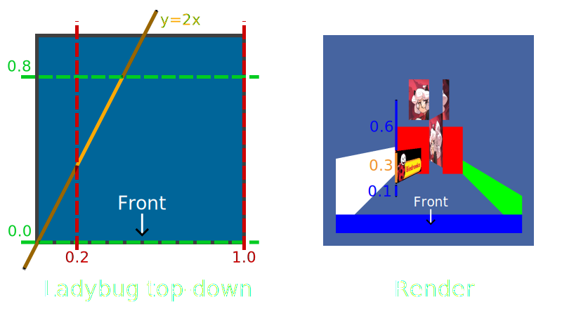

# RPGE Scene

Scene is a collection of tiles which form a 2D grid, each tile is assigned ID number which refers to a 1x1 square (in world units) containing specific definitions of walls that are later rendered. Tiles with ID of 0 are considered *air tiles* - they do and hold nothing.

## Coordinates system

Coordinates system can be either *global* (relative to the world origin) or *local* (relative to some tile origin), see illustration below:\

As you can see on the left, tiles are organized to lay on integer-coordinates thus creating a 2D grid, while on the right side you can see local surface of the tile where walls are defined.

## Tile walls
Single wall is just a vertically-aligned plane, which properties can be updated at runtime. You can have as many walls per tile as you want, but you should be aware of the fact that too many walls impact the rendering performance.

All editable wall properties are categorized by their function below:
- Geometrial
    - Linear equation
- Limiting
    - Arguments range
    - Values range
    - Height range
- Looking
    - Tint color
    - Texture ID
- Other
    - Ray-termination flag

Let me show you all of them in action:\

Ladybug wall (tile left) and demon wall (tile right) are inside some tile space which is exactly 1x1x1 (width, length and height).

Let me list properties of the ladybug wall:
- Linear equation :: y = 2x + 0
- Arguments range :: <0.2; 1.0>
- Values range :: <0.0; 0.8>
- Height range :: <0.1; 0.4>
- Tint color :: RGB(255, 255, 255)
- Texture ID :: (Number pointing loaded ladybug texture)
- Ray-termination flag :: 0

Notice that linear equation is defined on a local tile surface. Additionally saying, heights are marked in the render image and are defined in local tile space, I hope you get it right.

Speaking of the demon wall; it has ray-termination flag set, so rays cannot pass through pixel columns affected by it which is clearly visible in the render image - both walls behind are trimmed.
