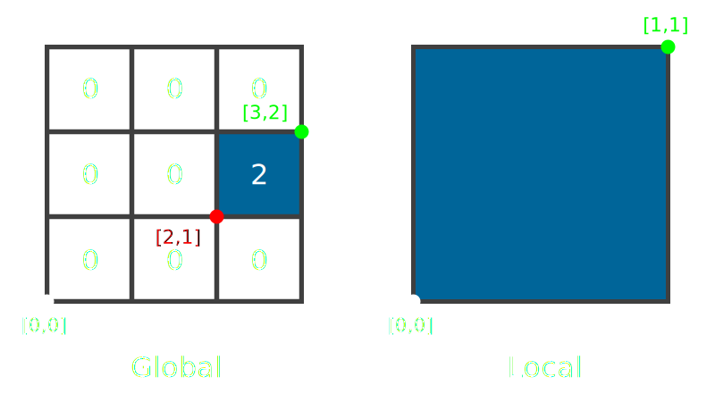

# RPGE Scene

## Description
Scene is a collection of tiles which form a 2D grid, each tile is a 1x1 square (in world units) containing definitions of walls that are later rendered.

Coordinates system can be either `global` (relative to the world origin) or `local` (relative to some tile origin), see illustration below:\

test
